### 背景
Ceph是一种为优秀的性能、可靠性和可扩展性而设计的统一的、分布式文件系统。摒弃了传统的集中式存储元数据寻址的方案，采用CRUSH算法，数据分布均衡，并行度高。考虑了容灾域的隔离，能够实现各类负载的副本放置规则
### Ceph架构介绍
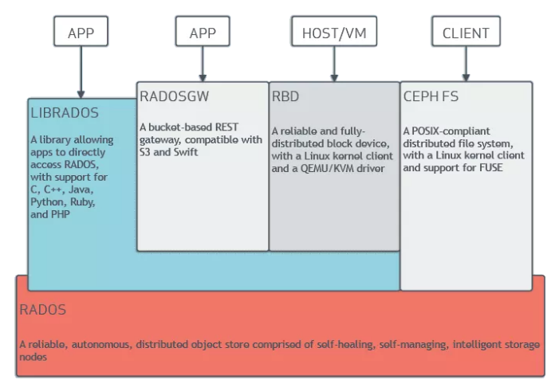
### Ceph在Axer项目的使用场景
+ 块存储：docker容器、虚拟机远程挂载磁盘存储分配、日志存储
+ 文件存储：多个用户有目录结构的文件存储共享
+ 对象存储: 

本文主要介绍cephfs在axer项目的对接使用及性能优化
### 什么是CephFS
Ceph FS是一个支持POSIX接口的文件系统，它使用 Ceph 存储集群来存储数据。文件系统对于客户端来说可以方便的挂载到本地使用。Ceph FS构建在RADOS之上，继承RADOS的容错性和扩展性，支持冗余副本和数据高可靠性。
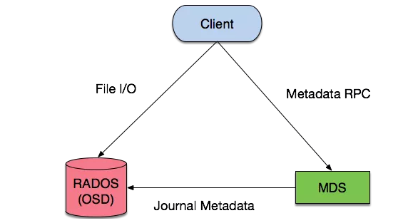
### 2. 可用资源列表
+ Supermicro SSG-6048R-E1CR24L HDD存储服务器8台，每台2*1.8T NVME SSD 24*5.5T HDD 256G内存 56核心
+ Supermicro SYS-2028U-TN24R4T+ SSD存储服务器4台, 每台5*3.2T SSD 256G内存 56核心
+ 每台机器4块万兆网卡，组成2个2万兆的网络
+ 1mgr，3mon，24个mds，24个active mds，0个standby mds
+ 目前的线上还有10台机器,需做数据迁移
### 3.实现方案
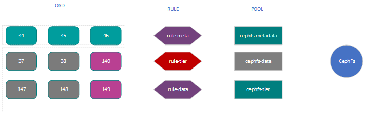
+ 将每台台NVME存储上的5块盘做成5个OSD，2个OSD划分到rule-meta,3个OSD划分到rule-tier
+ 划分3个pool,cephfs-metadata,cephfs-data,cephfs-tier
+ 每台存储至少部署一个mds服务,cache控制在64G
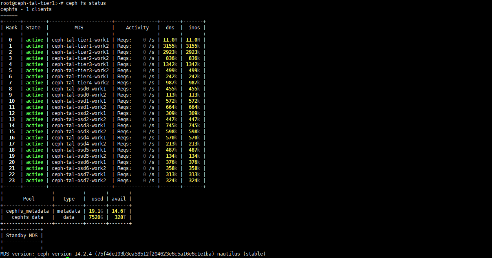
### Cache tier
&emsp;&emsp;Cache tier 是Ceph服务端缓存的一种方案，可以提升存储在后端存储层的I/O性能，Cache tier 的创建需要一个由高速而昂贵的存储设备（如SSD）组成的存储池作为缓存层，以及一个相对廉价设备组成的后端存储池作为经济存储层。Ceph的对象处理器决定往哪里存储对象，Cache tier决定何时把缓存内的对象刷回后端存储层，所以缓存层和后端存储层对于Ceph客户端来说是完全透明的。
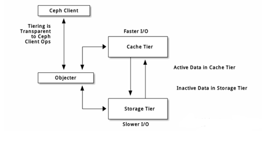

cache tier两种主要的工作模式:
+ •	 writeback： 管理员把缓存层配置为 writeback 模式时， Ceph 客户端们会把数据写入缓存层、并收到缓存层发来的 ACK ；写入缓存层的数据会被迁移到存储层、然后从缓存层刷掉。直观地看，缓存层位于后端存储层的“前面”，当 Ceph 客户端要读取的数据位于存储层时，缓存层代理会把这些数据迁移到缓存层，然后再发往 Ceph 客户端。从此， Ceph 客户端将与缓存层进行 I/O 操作，直到数据不再被读写。此模式对于易变数据来说较理想（如照片/视频编辑、事务数据等）。
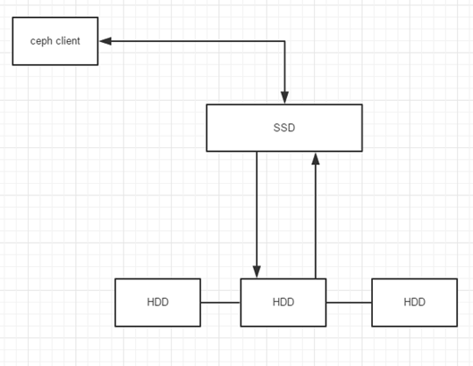
+  readonly： 管理员把缓存层配置为 readonly 模式时， Ceph 直接把数据写入后端。读取时， Ceph把相应对象从后端复制到缓存层，根据已定义策略、脏对象会被缓存层踢出。此模式适合不变数据（如社交网络上展示的图片/视频、 DNA 数据、 X-Ray 照片等），因为从缓存层读出的数据可能包含过期数据，即一致性较差。对易变数据不要用 readonly 模式。
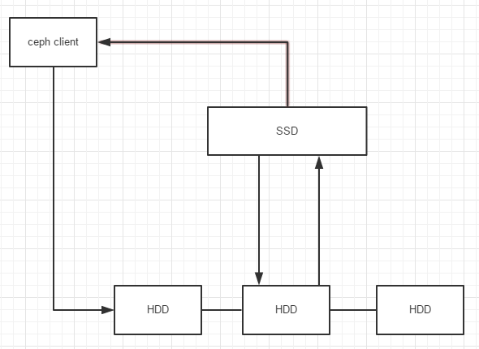
### 元数据的负载均衡
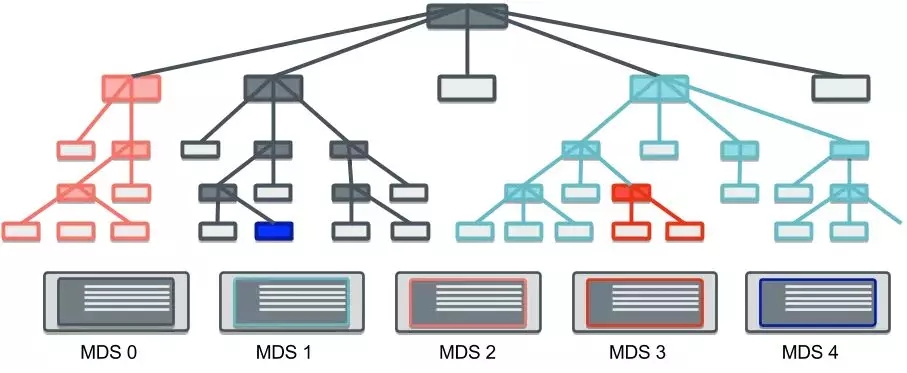
为了实现文件系统数据和元数据的负载均衡，业界一般有几种分区方法：
+ 静态子树分区

&emsp;&emsp;即通过手工分区方式，将数据直接分配到某个服务节点上，出现负载不均衡时，再由管理员手动重新进行分配。这种方式适应于数据位置固定的场景，不适合动态扩展、或者有可能出现异常的场景
+ Hash计算分区

&emsp;&emsp;即通过Hash计算来分配数据存储的位置，这种方式适合数据分布均衡、且需要应用各种异常的情况，但不太适合需要数据分布固定、环境变化频率很高的场景。
+ 动态子树分区

&emsp;&emsp;通过实时监控集群节点的负载，动态调整子树分布于不同的节点。这种方式适合各种异常场景，能根据负载的情况，动态的调整数据分布，不过如果大量数据的迁移肯定会导致业务抖动，影响性能。

### Cephfs使用SSD进行加速的几种可选方案
+ 作为OSD的日志盘
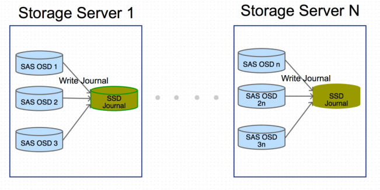
Ceph使用日志来提高性能及保证数据一致性。使用快速的SSD作为OSD的日志盘来提高集群性能是SSD应用于Ceph环境中最常见基本的加速方法，目前axer的每台物理机使用2块1.8T的NVME SSD划分成48个分区作为24
块HDD的日志与缓存盘进行加速
+ 与SATA、SAS硬盘混用，但独立组成全SSD的Pool
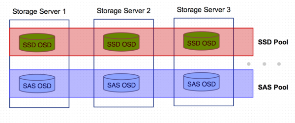
基本实现思路是编辑CRUSH MAP，先标示出散落在各存储服务器的SSD OSD以及硬盘OSD(host元素)，再把这两种类型的OSD聚合起来形成两种不同的数据根(root元素)，然后针对两种不同的数据源分别编写数据存取规则(rule元素)，最后，创建SSD Pool，并指定其数据存取操作都在SSD OSD上进行。
+ 配置CRUSH数据读写规则，使主备数据中的主数据落在SSD的OSD上
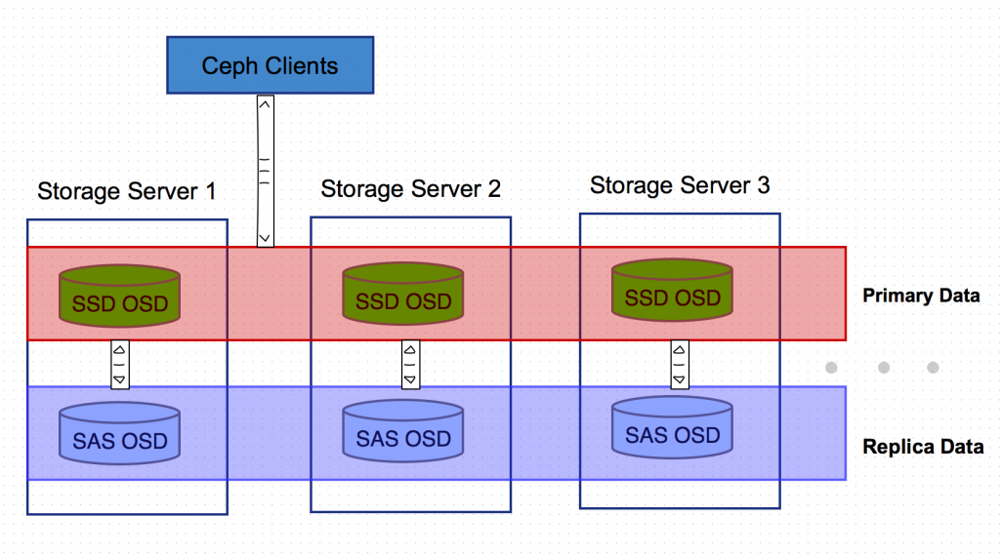
在axer训练的过程中发现用户对读的能力比写的能力要求的更好，基于此应用场景，划分了6块SSD硬盘配置CURSH读取规则，让所有数据的主备份落在SSD OSD上。Ceph集群内部的数据备份从SSD的主OSD往非SSD的副OSD写数据。
```bash
# 获取集群crushmap
$ ceph osd getcrushmap -o crush.bin
# 反编译crushmap
$ crushtool -d crush.bin -o crush.txt
# 编辑crushmap
rule rule-ssd-primary {
        id 3
        type replicated
        min_size 1
        max_size 10
        step take root-tier
        step chooseleaf firstn 1 type host
        step emit
        step take root-data
        step chooseleaf firstn -1 type host
        step emit
}
# 编译crushmap
$ crushtool -c crush.txt -o crush.tal.bin
# 注入crushmap
$ ceph osd setcrushmap -i crush.tal.bin
```
+ 组建cache tier，作为读操作的cache层
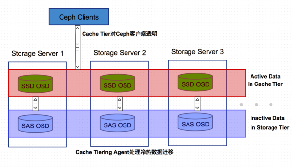
Cache Tiering的基本思想是冷热数据分离，用相对快速/昂贵的存储设备如SSD盘，组成一个Pool来作为Cache层，后端用相对慢速/廉价的设备来组建冷数据存储池。
Ceph Cache Tiering Agent处理缓存层和存储层的数据的自动迁移，对客户端透明操作透明。Cahe层有两种典型使用模式：
+ Writeback模式： 
Ceph客户端直接往Cache层写数据，写完立即返回，Agent再及时把数据迁移到冷数据池。当客户端取不在Cache层的冷数据时，Agent负责把冷数据迁移到Cache层。也就是说，Ceph客户端直接在Cache层上进行IO读写操作，不会与相对慢速的冷数据池进行数据交换。
+ 只读模式 Ceph客户端在写操作时往后端冷数据池直接写，读数据时，Ceph把数据从后端读取到Cache层。
这种模式适用于不可变数据，如微博/微信上的照片/视频等

 ### 实现
+ 将不同的硬盘根据需求划分组
```bash
# 创建虚拟根
ceph osd crush add-bucket root-meta root
ceph osd crush add-bucket root-data root
ceph osd crush add-bucket root-tier root
```
+ 创建规则集
```
ceph osd crush rule create-simple rule-meta  root-meta host
ceph osd crush rule create-simple rule-data  root-data host
ceph osd crush rule create-simple rule-tier  root-tier host
```
+ 创建虚拟主机
```
## 元素据
ceph osd crush add-bucket host-vir-meta1 host
ceph osd crush add-bucket host-vir-meta2 host
ceph osd crush add-bucket host-vir-meta3 host
ceph osd crush add-bucket host-vir-meta4 host
 
# 读SSD加速盘
ceph osd crush add-bucket host-vir-tier1 host
ceph osd crush add-bucket host-vir-tier2 host
ceph osd crush add-bucket host-vir-tier3 host
ceph osd crush add-bucket host-vir-tier4 host
```
+ 移动虚拟主机及主机对OSD进行分类
```
# 数据池
ceph osd crush move ceph-tal-osd0 root=root-data
ceph osd crush move ceph-tal-osd1 root=root-data
ceph osd crush move ceph-tal-osd2 root=root-data
......
# 元数据池
ceph osd crush move host-vir-meta1 root=root-meta
......
#移动OSD到meta的虚拟主机
ceph osd crush move osd.0 host=host-vir-meta1
......
```
+ 根据规则创建相关存储池
```
ceph osd pool create cephfs_data 8192 8192 replicated rule-data
ceph osd pool create cephfs_metadata 1024 1024 replicated rule-meta
ceph osd pool create cephfs_tier 256 256 replicated rule-tier
ceph osd pool set cephfs_tier size 2
```
+ 创建filesystem
```
ceph fs new fstal cephfs_metadata cephfs_data
ceph fs ls
```
### 可行性测试
+ 准备测试程序
```
enum IOMeterType {
    IO_METER_RANDREAD = 0,      // 测试随机读的I/O
    IO_METER_RANDWRITE = 1,     // 测试随机写的I/O
    IO_METER_DIRSCAN = 2,       // 1级目录扫描
    IO_METER_RANDDELETE = 3     // 随机删除
};
 
class IOMeter {
public:
    IOMeter(int bs)
    {
        buffer = make_shared_array<char>(bs);
    };
 
    virtual bool preproccess(std::string & dir) = 0;
    virtual bool io_entity(std::string file, int bs, int serial) = 0;
 
    virtual std::string to_string() = 0;
    virtual IOMeterType meter_type() const = 0;
 
protected:
    template<typename T>
    std::shared_ptr<T> make_shared_array(size_t size)
    {
        return std::shared_ptr<T>(new T[size], std::default_delete<T[]>());
    }
 
protected:
    std::shared_ptr<char> buffer;
};
template <typename compare = Compare>
class DirScanner : public IOMeter {
};
......
```
+ 测试程序开30个POD，每个POD写入40万文件,一共写入cephfs集群1200万文件
```
image: harbor.platform.facethink.com/axer-train/caffe-tf1.8-py2-base-cuda9.0-cudnn7-devel-ubuntu16.04-cmd-ssh:v1.8.1-bench1
command: ["/workspace/bench.out","--bs","20480", "--nrfiles", "400000"]
```
+ 测试结果
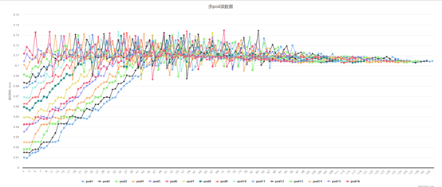
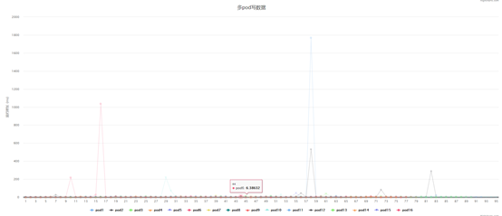
### 结论
+ 运行期间iops达到：16.8k，client_request达到：5.767k
+ 多pod 读一张图片的时间在稳定运行后，时间在0.09~0.13 ms之间